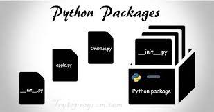
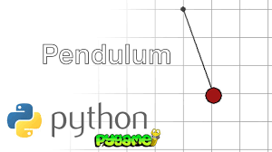

                                                  
# **Python Packages**    
We learned that modules are files containing Python statements and definitions, like function and class definitions. We will learn in this chapter how to bundle multiple modules together to form a package.

A package is basically a directory with Python files and a file with the name __init__.py. This means that every directory inside of the Python path, which contains a file named __init__.py, will be treated as a package by Python. It's possible to put several modules into a Package.

Packages are a way of structuring Python’s module namespace by using "dotted module names". A.B stands for a submodule named B in a package named A. Two different packages like P1 and P2 can both have modules with the same name, let's say A, for example. The submodule A of the package P1 and the submodule A of the package P2 can be totally different. A package is imported like a "normal" module. We will start this chapter with a simple example.

## **Creating a Package** 
We will demonstrate with a very simple example how to create a package with some Python modules. First of all, we need a directory. The name of this directory will be the name of the package, which we want to create. We will call our package "simple_package". This directory needs to contain a file with the name __init__.py. This file can be empty, or it can contain valid Python code. This code will be executed when a package is imported, so it can be used to initialize a package, e.g. to make sure that some other modules are imported or some values set. Now we can put all of the Python files which will be the submodules of our module into this directory. We create two simple files a.py and b.py just for the sake of filling the package with modules.

The content of a.py:

def bar():
    print("Hello, function 'bar' from module 'a' calling")

The content of b.py:

def foo():
    print("Hello, function 'foo' from module 'b' calling")

We will also add an empty file with the name __init__.py inside of simple_package directory.

Package can be loaded or imported by using the following syntaxes:-
1) from simple_package import a, b
2) import simple_package
   simple_package.a.bar()
   simple_package.b.foo()

## **Some important packages in Python** 
1) ### NumPy
   
   You can do basic mathematical operations without any special Python packages. However, if you’re going to do any kind of complex math.NumPy provides tools to help build multi-dimensional arrays and perform calculations on the data stored in them. You can solve algebraic formulas, perform common statistical operations, and much more.
   #### Syntax to install and import NumPy package
   pip install numpy
   import numpy

2) ### Pendulum
 

   If you have at least a little Python programming experience, you probably know that you can use the datetime module to manage dates and times within an application.

   While datetime is great for basic work along these lines, the Pendulum Python package makes it easier to do more complex coding involving dates and times. It’s more intuitive to work with, and it manages time zones automatically.

   Best of all, Pendulum is designed to be a drop-in replacement for datetime. That means you can use it with code you’ve already written based on datetime. With only a few exceptions, Pendulum will work just as well, without the need to modify the code, while providing extra features not present in plain-old datetime. 
   
   #### Syntax to install and import Pendulum package
   pip install pendulum
   import pendulum
3)  SciPy
   

   
   SciPy is an open-source Python package which is used to solve scientific and mathematical problems. It is built on the NumPy extension and allows the user to manipulate and visualize data with a wide range of high-level commands. Both NumPy and SciPy are Python libraries used for used mathematical and numerical analysis. NumPy contains array data and basic operations such as sorting, indexing, etc whereas, SciPy consists of all the numerical code. Though NumPy provides a number of functions that can help resolve linear algebra, Fourier transforms, etc, SciPy is the library that actually contains fully-featured versions of these functions along with many others. As mentioned earlier, SciPy builds on NumPy and therefore if you import SciPy, there is no need to import NumPy.

4) #### MoviePy
    
    MoviePy is to videos what Pillow is to images. It provides a range of functionality for common tasks associated with importing, modifying, and exporting video files. It also lets you do things like insert titles into videos or rotate videos 90 degrees (if for some reason you decide you want to do that).

    Like Pillow, MoviePy is not intended as a tool for advanced data manipulation. If you’re writing a video editing app, you’ll probably also need to rely on OpenCV (which can work with videos as well as images) to provide the advanced functionality that MoviePy lacks. But for most standard tasks involving videos in Python code, MoviePy gets the job done quite well.
